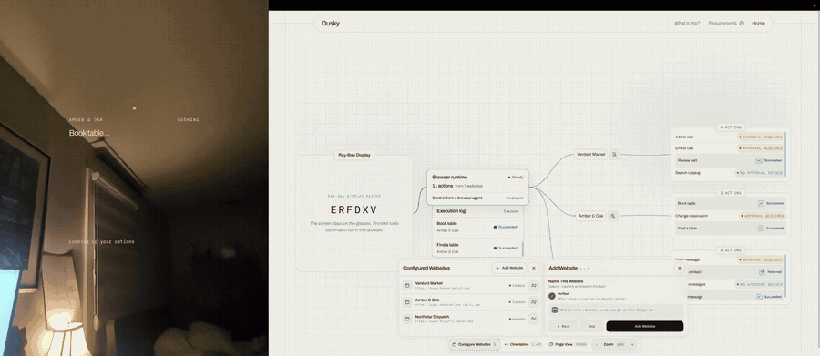
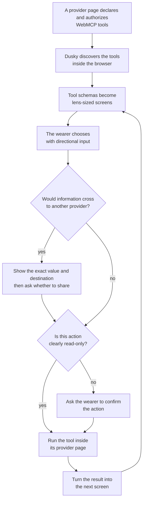

# Dusky

**Turn web actions into augmented reality.**

Headsets can provide enormous virtual screens. Glasses can stay with you
throughout the day, but the small form factor that makes them practical also
makes ordinary page layouts a poor fit. Meta Ray-Ban Display gives a web app a
600 by 600 canvas, directional controls, and no pointer. A page does not become
a glasses interface just because it gets smaller.

Dusky does not try to squeeze a whole website onto the glasses. It uses the
things the site says it can do to build a simple interface that fits the display
and works with its controls.

A participating site uses
[WebMCP](https://github.com/webmachinelearning/webmcp) to publish a structured
list of actions, such as searching a catalogue, reserving a table, or sending a
message. Dusky turns those declarations into lens-sized screens, one choice or
question at a time.
The tool still runs inside the site's own browser page. Dusky supplies the
interface, task flow, and wearer confirmation. Providers do not design a
separate glasses UI, and Dusky does not need a custom adapter for each one.



## Why WebMCP and display glasses fit together

Display glasses are moving from prototypes into a product category.
[Meta put Ray-Ban Display on sale in 2025](https://about.fb.com/news/2025/09/meta-ray-ban-display-ai-glasses-emg-wristband/).
[Google describes Android XR as a unified platform for headsets and
glasses](https://blog.google/products-and-platforms/platforms/android/android-xr/),
and is building eyewear with Samsung, Gentle Monster, and Warby Parker. In 2026,
[Google detailed both audio and display eyewear](https://blog.google/products-and-platforms/platforms/android/android-xr-io-2026/)
and announced that its first audio models would arrive in the fall. The wider
Android XR ecosystem is already shipping: Google says Samsung Galaxy XR launched
in 2025 and [more than 100 immersive apps were available by April 2026, more
than double the number at launch](https://blog.google/products-and-platforms/platforms/android/android-xr-immersive-features-update-april-2026/).

That does not prove mass adoption, and it does not prove which platform will
win. It does mean developers are beginning to face several wearable platforms,
not one isolated prototype.

The web was built around pages with room to scroll and a pointer to aim.
Responsive design can rearrange navigation, forms, popovers, and checkout
flows, but it cannot turn them into an interaction that works with six keys and
no cursor. Asking every site to build a separate interface for every pair of
glasses would repeat the fragmentation that web standards are supposed to
avoid.

[WebMCP changes the unit of integration](https://github.com/webmachinelearning/webmcp).
A site can publish structured, browser-mediated actions with names,
descriptions, and input schemas. Dusky can turn a short list of allowed values
into choices, a true or false value into Yes or No, and a text parameter into
the glasses composer. One tool can become several small screens without the
provider designing each screen.

That is the bet behind Dusky: WebMCP makes a site's useful capabilities
portable beyond its page layout, while display glasses need useful web tasks
without the page layout. Together they let the web reach a new kind of display
without requiring a new glasses app for every site.

## One task, several providers

Dusky can hold actions from several participating providers at once.

> Reserve a table for four, then send the reservation details to Dana.

The restaurant and communications service have no partnership and do not need
a custom connector between them. Each action remains attached to the provider
that declared it. Before it runs, Dusky checks that the action and its expected
inputs have not changed.

Crossing that boundary is never silent. Before information from one provider
becomes an input at another, the glasses show the source, destination, and exact
value. The wearer decides whether to share it. Sharing that value does not
approve the destination action. Unless Dusky can determine that the destination
action only reads information, the wearer confirms it separately before it
runs.

The glasses are not just the smallest screen in the system. They are where the
person sees what will happen and decides whether it should.

## How it works



The browser keeps each provider's live capabilities and any session state
available to its page. The console runs the tool there. The relay keeps the
current task, exchanges invocation requests and results with the console, and
sends each new screen to the glasses. An optional planner can suggest a short
sequence of actions, but ordinary code checks every suggestion and applies the
same confirmation rules to every step.

The optional planner has first-class OpenAI and Anthropic adapters behind one
provider-neutral interface. OpenAI planning uses the Responses API with strict
Structured Outputs; Anthropic planning uses the Messages API with the same
stable decision shape. The operator selects one provider explicitly on the
relay. Neither model executes a WebMCP tool or authorizes an action.

WebMCP remains Dusky's browser capability and invocation mechanism. Model API
support is optional internal planning architecture, not a WebMCP Challenge
requirement and not a substitute for provider WebMCP declarations.

There is no provider-specific execution branch in the shared runtime. The
market, reservation service, communications desk, and a fourth provider loaded
only during the browser test use different tool and result vocabularies.

## Try it without glasses

Use Node.js 22 or newer, pnpm 10, and Chrome with
`chrome://flags/#enable-webmcp-testing` enabled.

```bash
pnpm install
pnpm dev
```

Open <http://localhost:7803> and choose **Open Dusky**. The browser shows the
glasses interface beside three live provider pages. Move with the arrow keys,
choose with Enter, and go back with Escape. Selecting an action on the Display
runs a real WebMCP tool inside the provider page, so both ends are visible in
one tab.

A model is optional. The menus work without one; natural-language requests use
an explicitly selected OpenAI or Anthropic adapter. Missing configuration,
refusal, timeout, or provider outage falls back to deterministic navigation.
The exact planner-enabled setup is documented in the [demo guide](./docs/DEMO.md).

The same guide covers pairing and the complete walkthrough.

## Audit it with a provider Dusky has never seen

The three visible providers are named in the default demo registry, but the
shared runtime handles them without provider-specific adapters or execution
branches. A fourth public provider is supplied at runtime and works without
changing Dusky's source registry, rebuilding the console, or adding an adapter.

Paste this URL through **Configure Websites → Add Website**:

```text
https://dusky-canopy-lab.glendonchin.chatgpt.site
```

Canopy Lab exposes one read-only **Estimate shade** action to the local and
official Dusky console origins. Its production round-trip test loads it by URL,
discovers the action, renders the `zone` choices, invokes `garden`, observes the
provider's own page update, and renders the returned result on the Display.

To load another provider, pass its encoded URL:

```text
http://localhost:7803/demo?start=1&site=<encoded-provider-url>
```

Repeat `site` to load several providers at once. A provider must register WebMCP
tools, permit embedding, and explicitly authorize the exact Dusky console
origin. Dusky currently supports the parameter shapes documented in the
[provider guide](./docs/PROVIDER-GUIDE.md). This is an authorization and schema
contract. Those are deliberate compatibility requirements. Dusky does not gain
automatic access to every website.

The genericity claim is narrow and testable: shared production packages do not
switch on a known provider, origin, tool name, or result key. See
[Genericity](./docs/GENERICITY.md) for the guardrails and their limits.

## Verified locally

- 451 unit and deterministic tests pass, including stub-backed OpenAI and
  Anthropic adapter coverage that needs no live credential.
- All 49 real-browser tests pass in Chrome with WebMCP enabled.
- The isolated round-trip suite passes 7 of 7 tests.
- The browser suite discovers eleven actions from three visible providers,
  loads a fourth provider at runtime, invokes real WebMCP tools, and completes
  the consented reservation-to-message transfer.
- The transfer test uses a deterministic planner and real WebMCP tools, so it
  exercises the cross-provider data and consent path without a model credential.
- All 15 typechecks and six builds pass. Lint has no errors and retains the five
  documented CSS specificity warnings.

These are local results for the current tree. Historical deployment evidence
and hardware gaps are recorded separately in
[Verification](./docs/VERIFICATION.md).

## Repository map

| Path | Responsibility |
| --- | --- |
| `apps/display` | The 600 by 600 interface shown on Meta Ray-Ban Display. |
| `apps/console` | Discovers and invokes provider tools inside the browser. |
| `apps/server` | Relays sessions and preserves the current task. |
| `apps/market`, `apps/reservations`, `apps/dispatch` | Unrelated test providers used to expose genericity bugs. |
| `packages/frames` | Compiles supported tool schemas into Display frames. |
| `packages/policy` | Applies deterministic confirmation rules. |
| `packages/session` | Runs the task state machine and validates every step. |
| `packages/planner` | Optionally proposes bounded plans through OpenAI or Anthropic adapters. |
| `packages/webmcp` | Contains browser-specific WebMCP compatibility code. |
| `e2e` | Exercises the complete path in real Chrome. |

## Read the system

- [Architecture](./docs/ARCHITECTURE.md) maps the browser, relay, Display, and
  optional planner.
- [Trust model](./docs/TRUST-MODEL.md) explains confirmation, transfer consent,
  and hostile-provider boundaries.
- [Provider guide](./docs/PROVIDER-GUIDE.md) defines what a provider must expose
  and authorize.
- [WebMCP runtime](./docs/WEBMCP-RUNTIME.md) records where browser behavior
  differs from the published API.
- [Contributing](./CONTRIBUTING.md), [Security](./SECURITY.md), and
  [Deployment](./DEPLOY.md) cover project operations.

## Limits

- Dusky cannot use an arbitrary website. The provider must implement WebMCP,
  permit embedding, authorize the console origin, and use supported schemas.
- Dusky requires confirmation when a declaration contains known danger signals,
  but it cannot prove that a hostile provider described every side effect
  honestly.
- Automated browser tests do not replace a final pass on physical glasses.
  Waveguide readability, Neural Band behavior, composer input, sleep recovery,
  and device load time require hardware verification.

## License

MIT. See [LICENSE](./LICENSE).
