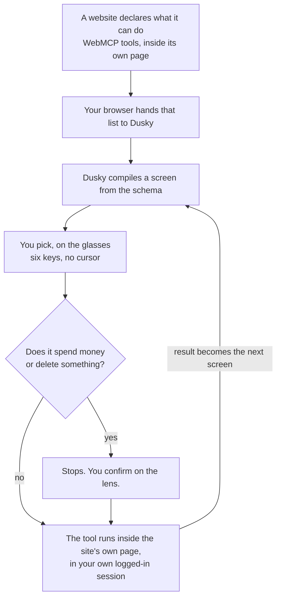

# Dusky

**A remote control for everything you are signed into.**

Dusky reads what every site in your browser can do, over
[WebMCP](https://github.com/webmachinelearning/webmcp), and puts all of it on a
pair of glasses as one list. Starting with Meta Ray-Ban Display.

One sentence can cross two businesses that have never heard of each other.
Nothing that costs you anything happens without you saying yes.

## Why

Smart glasses are the wearable that is going to stick. A headset like Vision Pro
or Quest has a display better than most laptops and nobody wears one down the
street. Glasses have the form factor people already accept, adoption has climbed
every year, and Google and Samsung are building Android XR with Warby Parker and
Gentle Monster as eyewear partners. This stops being a curiosity and becomes a
daily-carry device.

The price of that form factor is the screen. Meta Ray-Ban Display is the one
shipping with a display today, and it is 600x600, six keys of input, no cursor,
no pointer. You cannot reflow a website onto that. Responsive design is about
layout, and there is no layout small enough.

So take the actions instead of the page. A site that speaks WebMCP publishes what
it can *do*: search a catalogue, add something to a cart, review it, check out.
Dusky reads that list and assembles a screen for it, one question at a time,
sized for the lens. No app per site, no app store, no per-device port, and
nothing for the site to build beyond declaring its tools.

There is no code in this repository for any particular website.

## The part that needs no integration

Dusky holds every participating site at once, not one at a time. That is a
smaller change than it sounds and a bigger claim than it looks.

"Book a table for two tomorrow and add oat milk to my cart" is one errand across
a restaurant and a shop. The two businesses have never heard of each other,
there is no partnership, no connector and no code here that knows either exists.
Doing that normally needs somebody to build the bridge. An app cannot do it at
all, because an app belongs to one company.

The browser is what makes it possible, because the browser is the one place that
already holds all of your sessions. So the glasses stop being a screen and
become the place a person says yes: an agent may propose anything, across
anything, and `packages/session` still stops every consequential step and waits
for the wearer.

That sentence is one task, not a slogan over two separate demos. The planner
returns the restaurant action and the shop action as an ordered plan. Dusky
validates the whole plan before starting, caps it at four actions, and refuses
all of it if any action was not actually offered. After the first result, the
lens shows the next action and its position in the task. The wearer advances it,
then the second action reaches its own policy gate. One approval never covers
two calls.

One rule earns its keep the moment several sites are held at once. A lookup that
fills in a missing value runs without asking anybody, so it may only ever use a
tool from the SAME SITE as the action it is filling in. Otherwise what somebody
said out loud about a restaurant could be handed to a shop that has nothing to
do with it, quietly, on the one path with nobody watching.

## How it works



Three things worth pointing at:

- **One tool becomes several screens.** Dusky reads the tool's parameters and
  asks for them one at a time. A list of allowed values becomes buttons. A
  true/false becomes Yes/No. Free text opens the keyboard on the glasses. Long
  lists get paged.
- **Dusky adds the confirmation step.** The site did not ask for it and cannot
  switch it off. Anything that spends money or deletes something stops and waits
  for you.
- **One request can contain several actions.** Every action stays attached to
  the site that offered it, is checked against that site's live schema before it
  starts, and receives its own confirmation. A broken step rejects the plan
  instead of disappearing from the sentence.
- **Nothing is proxied.** The tool runs in the site's own page, in your browser,
  in your session. Dusky never sees a login or a password.

## Try it, without glasses

You need **Chrome 149+** with `chrome://flags/#enable-webmcp-testing`, or **the
ChatGPT desktop app's built-in browser**, which has it on already.

```bash
pnpm install && pnpm dev
```

Open <http://localhost:7803> and press **Open Dusky**. You get everything in one
tab: the glasses view on the left, both partner sites on the right, and every
WebMCP call underneath as it happens.

Press a row on the glasses panel and watch that site change next to it.
That is the part worth looking at. The panel itself is a small black rectangle
with text on it, because that is what a 600x600 additive waveguide renders, but
pressing a row on it runs a real tool inside the real site and you can watch
both ends of that at once.

Move with <kbd>↑</kbd><kbd>↓</kbd>, choose with <kbd>Enter</kbd>, back with
<kbd>Esc</kbd>. Those six keys are the entire input surface of the real device,
which is why the same build runs here and on the glasses unchanged.

Both sites are live at the same time, and their actions are on one list. Amber &
Oak is a restaurant, it shares no vocabulary with the shop, and Dusky builds a
screen for each from the schema alone. Seven actions do not fit a four-row
panel, so the menu you land on is a row per business and a site's own actions
are one press behind it.

Add `?source=market` to the URL to hold a single site instead. Nothing on the
page offers that, because a control for using less of the product is not one
anybody wants; it is there for tests and for a slow connection.

## What is in here

| Path | What it is |
| --- | --- |
| `apps/display` | The 600x600 Web App. What the wearer sees. |
| `apps/console` | The website and the demo. The only surface that touches WebMCP. |
| `apps/server` | Session relay. Owns task state so a reload cannot lose your place. |
| `apps/market`, `apps/reservations` | Two unrelated first-party test services. Nothing is sold or reserved. |
| `packages/frames` | The schema-to-frame compiler. Knows no site. |
| `packages/policy` | Deterministic trust rules. No model, no network, no DOM. |
| `packages/session` | The task machine. Intent in, frames out. |
| `packages/planner` | Optional. Turns a spoken request into a bounded plan it cannot enforce. |
| `packages/webmcp` | The only file that knows what browsers actually do, versus what the spec says. |
| `packages/lens`, `packages/tokens`, `packages/contracts` | The panel, the palettes, the shared types. |
| `e2e` | The round trip, in real Chrome with the real flag. |

## Limits

- **It does not work with any website.** A site has to name Dusky in
  `exposedTo` before the browser will hand over its tools. That rule is the
  browser's, and it is the right one: otherwise any page could read the tools of
  every site you had open. "Everything you are signed into" means everything
  that has granted Dusky access, which today is two first-party test services.
- **A model can be wrong.** Nothing consequential runs without you confirming
  it, and Dusky only reports success if the tool actually returned it.
- **No microphone or camera on the glasses**, and no raw gestures. The OS moves
  focus and tells the app what you picked.

## More

- [AGENTS.md](./AGENTS.md): how it is built, and why each decision went the way
  it did. Includes what Chrome actually does versus what the spec says.
- [FIELD-NOTES.md](./FIELD-NOTES.md): bugs found by wearing it.
- [DEPLOY.md](./DEPLOY.md): hosting, and getting it onto a pair of glasses.

```bash
pnpm test        # unit
pnpm test:e2e    # round trip in real Chrome with the WebMCP flag
pnpm typecheck && pnpm lint
```

## License

MIT. See [LICENSE](./LICENSE).
