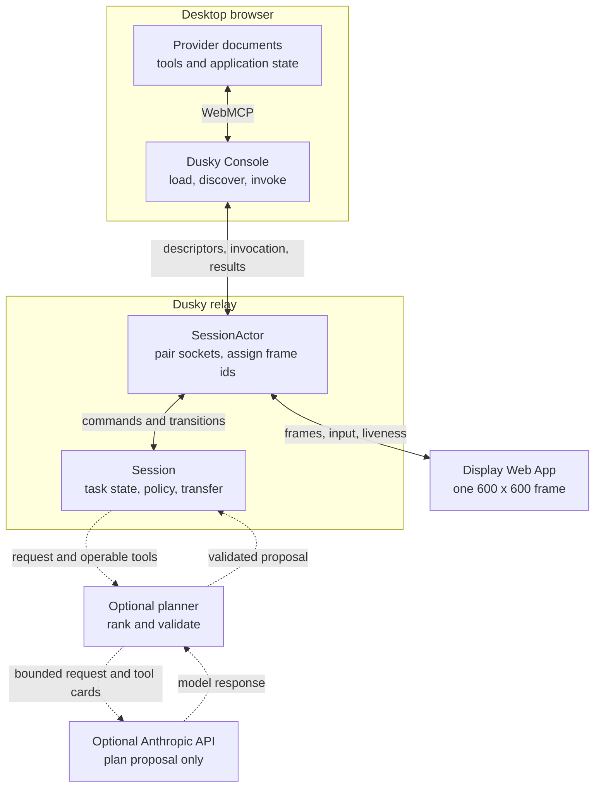

# Architecture

Dusky converts WebMCP tool declarations from authorized provider pages into a
gesture-driven interface on Meta Ray-Ban Display.

The system has three runtime surfaces. Keeping them separate is the central
architectural decision.

## Surfaces and data flow

### Display

`apps/display` is the Web App that runs on the glasses. The same build runs in
a desktop browser for testing.

It renders one `DisplayFrame` and sends a small input vocabulary:

- selected choice;
- committed text;
- cancellation;
- liveness traffic.

It does not discover tools, execute tools, apply policy, or own task state. The
device has a fixed 600 by 600 viewport with no scrolling or pointer, so Dusky
limits a frame to four interactive rows. Parameter and projection screens keep
a Back row. Provider submenus keep Back to sites.

### Console

`apps/console` is the WebMCP consumer. It runs in a normal browser because live
tool handles belong to the provider documents in that browser context.

The console loads configured provider URLs in `allow="tools"` iframes. The
provider must permit embedding and authorize the exact console origin through
`exposedTo`. `packages/webmcp` asks only for tools from those origins,
normalizes descriptors, and retains the live handles required for invocation.

The bridge accepts only tools whose browser-supplied origin was requested.
Tool identity is `(origin, name)`. A name alone is not unique because several
origins may publish the same name.

When the relay requests an invocation, it includes the exact descriptor used
for parameter handling and policy. The console refuses a live handle whose
descriptor no longer matches, otherwise executes it once in the provider
document and sends the raw result string to the relay.

The default source registry contains display names and URLs. It contains no
tool definitions, policy, UI mappings, invocation adapters, or result parsers.
Runtime `site` query values can replace that registry for one console page.
They choose pages to load and do not grant WebMCP access.

### Relay

`apps/server` pairs one Display socket with one console socket. Each pairing
code receives a `SessionActor`.

The actor owns transport lifetime, the `Session`, the current wire frame id,
provider display labels, and outstanding console requests. It routes every
`Session.onTransition` through the Display socket. It rejects an input whose
frame id no longer matches the frame being shown.

The `Session` owns task state, menus, parameter collection, policy gates,
bounded result projections, transfer consent, and results. It never touches a
DOM, WebSocket, or model provider directly.

Discovery and invocation always return to the paired console. A console reload
with the same provider origins refreshes live handles under the current task.
A Display reconnect receives the current frame with the same identifier when
the content has not changed, so focus does not reset.

### Optional model provider

The planner is disabled by default. When `DUSKY_PLANNER=on`, the relay sends
the wearer's request and a ranked shortlist of bounded tool cards to the
Anthropic API. Cards can contain the browser-supplied origin plus
provider-authored names, titles, descriptions, normalized parameter kinds and
descriptions, enum values, and the untrusted-content flag. They also state the
ceremony derived by Dusky policy.

`safeText` strips control characters and quotes, collapses whitespace, and
bounds each provider-authored field before it enters the prompt. That prevents
card-structure forgery, not persuasion. Planner output remains untrusted and
cannot authorize an invocation or lower a policy gate.

## Shared packages

| Package | Responsibility |
| --- | --- |
| `packages/contracts` | Tool descriptors, frames, wire messages, audit events, and agent requests |
| `packages/webmcp` | Browser compatibility, discovery, filtering, argument-shape probing, and one-shot invocation |
| `packages/frames` | Display-operable parameters, menus, paging, result facts, and projections |
| `packages/policy` | Deterministic read, write, financial, and destructive classification |
| `packages/planner` | Optional ranking and bounded plan proposals |
| `packages/session` | Task state, supported argument checks, gates, transfer consent, and completion |
| `packages/audit` | Structured decision and outcome events |
| `packages/lens` | Frame rendering and directional input translation |
| `packages/tokens` | Browser and additive-display design tokens |

Policy has no model, network, DOM, clock, random source, or application
dependency.

## A provider outside the default registry

Playwright starts `e2e/runtime-provider` on port `7806`. It is absent from the
default console registry and declares vocabulary not used by the bundled
providers.

The round-trip test supplies only its URL and display name. The console
discovers it, the Display builds its enum screen, the provider records the
invocation, and the result becomes generic facts. No shared package receives a
provider branch or adapter.

## What this architecture does not do

Dusky does not discover arbitrary tabs or websites. A provider URL must be
configured, its page must load in the console iframe, it must publish WebMCP
tools, and it must authorize the console origin.

The optional planner does not replace deterministic validation. Menu-driven
operation remains available when the planner is disabled or fails.

The repository does not prove that every existing top-level login remains
available inside every cross-origin provider iframe. Cookie partitioning and
provider authentication policy remain browser and provider concerns.

See [Trust model](./TRUST-MODEL.md) for authorization and consent boundaries.
