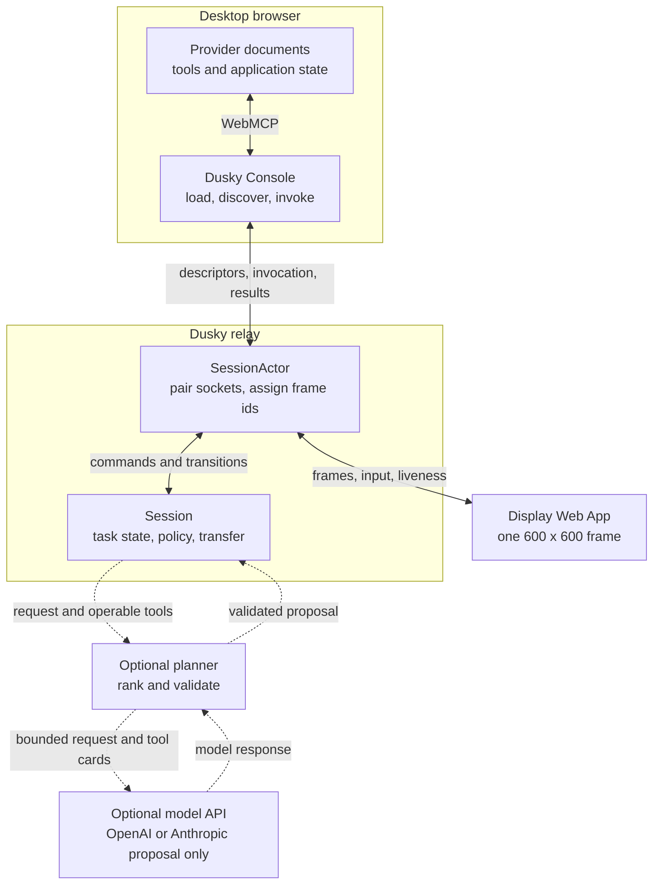

# Architecture

Dusky converts WebMCP tool declarations from authorized provider pages into a
gesture-driven interface on Meta Ray-Ban Display.

The system has three runtime surfaces. Keeping them separate is the central
architectural decision.

## Surfaces and data flow

### Display

`apps/display` is the Web App that runs on the glasses. The same build runs in
a desktop browser for testing.

It renders one `DisplayFrame` and sends a small input vocabulary:

- selected choice;
- committed text;
- cancellation;
- liveness traffic.

It does not discover tools, execute tools, apply policy, or own task state. The
device has a fixed 600 by 600 viewport with no scrolling or pointer, so Dusky
limits a frame to four interactive rows. Parameter and projection screens keep
a Back row. Provider submenus keep Back to sites.

### Console

`apps/console` is the WebMCP consumer. It runs in a normal browser because live
tool handles belong to the provider documents in that browser context.

The console loads configured provider URLs in `allow="tools"` iframes. The
provider must permit embedding and authorize the exact console origin through
`exposedTo`. `packages/webmcp` asks only for tools from those origins,
normalizes descriptors, and retains the live handles required for invocation.

The bridge accepts only tools whose browser-supplied origin was requested.
Tool identity is `(origin, name)`. A name alone is not unique because several
origins may publish the same name.

When the relay requests an invocation, it includes the exact descriptor used
for parameter handling and policy. The console refuses a live handle whose
descriptor no longer matches, otherwise executes it once in the provider
document and sends the raw result string to the relay.

The console's topology is runtime evidence, not an ambient animation. The
session relay sends revisioned, bounded snapshots and live events containing
Display presence, accepted input boundaries, visible frame phase, exact tool
identity, and semantic outcome. It never sends choices, text, arguments, raw
results, or provider prose in that stream. Separately, `packages/webmcp`
signals the console synchronously immediately before `executeTool`; that is
the only event allowed to light a provider route. A returned browser promise
is shown as returned until the `Session` classifies the result as succeeded,
failed, or unknown.

`apps/console/src/runtimeActivity.ts` reduces those two evidence sources by
relay revision and invocation request id. Reconnect snapshots hydrate durable
state without replaying motion, disconnect turns only running calls unknown,
and settled outcomes stay attached to the invocation after a later action
begins. The canvas renders one bounded directional trace, fades the residual
route, and returns to a static idle graph. Reduced-motion mode omits travel and
uses a brief static route cue; persistent action rows and the execution log use
text and shape in addition to color.

The default source registry contains display names and URLs. It contains no
tool definitions, policy, UI mappings, invocation adapters, or result parsers.
The bottom website tray can select bundled samples and add a provider URL into
the same live topology. Before an added URL can be connected, the console
temporarily mounts that page in a bounded `allow="tools"` preflight frame and
requires origin-filtered discovery to return at least one authorized WebMCP
tool. The preflight frame is then removed; it grants no access and retains no
live handle. Accepted additions, removals, and reconnects replace the origin
set immediately while the Display is idle. The authoritative provider frames
then load and discover again for the new relay-owned session. Shareable
`connection` query values contain only a sample id or an added display name and
URL. The console caps one connection set at eight live documents.

Applying a changed origin set is available only while the Display is idle.
The relay treats a different origin set as a new `Session`, because pending
parameters, confirmation, transfer, or invocation may name a tool that the new
set no longer holds. The graph, provider iframes, WebMCP discovery request,
relay site list, and Display menu all derive from the applied set.

Legacy runtime `site` query values still replace the default registry for the
isolated fourth-provider proof. Both configuration paths choose pages to load;
neither grants WebMCP access.

### Relay

`apps/server` pairs one Display socket with one console socket. Each pairing
code receives a `SessionActor`.

The actor owns transport lifetime, the `Session`, the current wire frame id,
provider display labels, and outstanding console requests. It routes every
`Session.onTransition` through the Display socket. It rejects an input whose
frame id no longer matches the frame being shown.

The actor also revisions the bounded console activity stream. It publishes
Display input only after the current-frame check passes, publishes frame
activity only when visible frame content changes, and sends a snapshot before
attach-time discovery can produce a newer event. That ordering lets a console
hydrate real Display presence before processing live transitions and prevents
reconnects or stale packets from fabricating activity.

The `Session` owns task state, menus, parameter collection, policy gates,
bounded result projections, transfer consent, and results. It never touches a
DOM, WebSocket, or model provider directly.

Discovery and invocation always return to the paired console. A console reload
with the same provider origins refreshes live handles under the current task.
A Display reconnect receives the current frame with the same identifier when
the content has not changed, so focus does not reset.

### Optional model provider

The planner is disabled by default. When `DUSKY_PLANNER=on`, the relay also
requires `DUSKY_MODEL_PROVIDER=openai` or `anthropic` and the matching
server-side credential. One server factory selects an `OpenAIModelClient` or
`AnthropicModelClient`; it never infers a provider from whichever key happens
to exist. Missing or invalid configuration produces one warning and leaves the
relay menu-only.

Both adapters implement the provider-neutral `ModelClient` port and request the
same stable `Decision` schema. The OpenAI adapter uses the Responses API with
strict Structured Outputs. The Anthropic adapter uses the Messages API with
structured output. Both preserve the fast and careful planning tiers, accept
operator model overrides, forward the planner's request deadline, and disable
SDK retries beneath the planner's own escalation budget.

The selected model API receives the wearer's request and a ranked shortlist of
bounded tool cards. Cards can contain the browser-supplied origin plus
provider-authored names, titles, descriptions, normalized parameter kinds and
descriptions, enum values, and the untrusted-content flag. They also state the
ceremony derived by Dusky policy.

`safeText` strips control characters and quotes, collapses whitespace, and
bounds each provider-authored field before it enters the prompt. That prevents
card-structure forgery, not persuasion. Planner output remains untrusted and
cannot authorize an invocation or lower a policy gate.

A provider refusal, incomplete or malformed structured answer, timeout, or
outage returns the wearer to deterministic menus and parameters. Transport,
authentication, quota, and service failures remain observable planner failures
rather than being disguised as model declines. Credentials stay in the relay
process and are never copied to the Display, console, provider documents,
frames, logs, or audit records.

## Shared packages

| Package | Responsibility |
| --- | --- |
| `packages/contracts` | Tool descriptors, frames, wire messages, audit events, and agent requests |
| `packages/webmcp` | Browser compatibility, discovery, filtering, argument-shape probing, and one-shot invocation |
| `packages/frames` | Display-operable parameters, menus, paging, result facts, and projections |
| `packages/policy` | Deterministic read, write, financial, and destructive classification |
| `packages/planner` | Optional ranking, provider-neutral decisions, and OpenAI/Anthropic model adapters |
| `packages/session` | Task state, supported argument checks, gates, transfer consent, and completion |
| `packages/audit` | Structured decision and outcome events |
| `packages/lens` | Frame rendering and directional input translation |
| `packages/tokens` | Browser and additive-display design tokens |

Policy has no model, network, DOM, clock, random source, or application
dependency.

## A provider outside the default registry

Playwright starts `e2e/runtime-provider` on port `7806`. It is absent from the
default console registry and declares vocabulary not used by the bundled
providers.

The round-trip test supplies only its URL and display name. A separate browser
test adds it through the same connection workspace that can mix it with the bundled
samples. The console discovers it, the Display builds its enum screen, the
provider records the invocation, and the result becomes generic facts. No
shared package receives a provider branch or adapter.

## What this architecture does not do

Dusky does not discover arbitrary tabs or websites. A provider URL must be
configured, its page must load in the console iframe, it must publish WebMCP
tools, and it must authorize the console origin.

The optional planner does not replace deterministic validation. Menu-driven
operation remains available when the planner is disabled or fails.

The repository does not prove that every existing top-level login remains
available inside every cross-origin provider iframe. Cookie partitioning and
provider authentication policy remain browser and provider concerns.

See [Trust model](./TRUST-MODEL.md) for authorization and consent boundaries.
