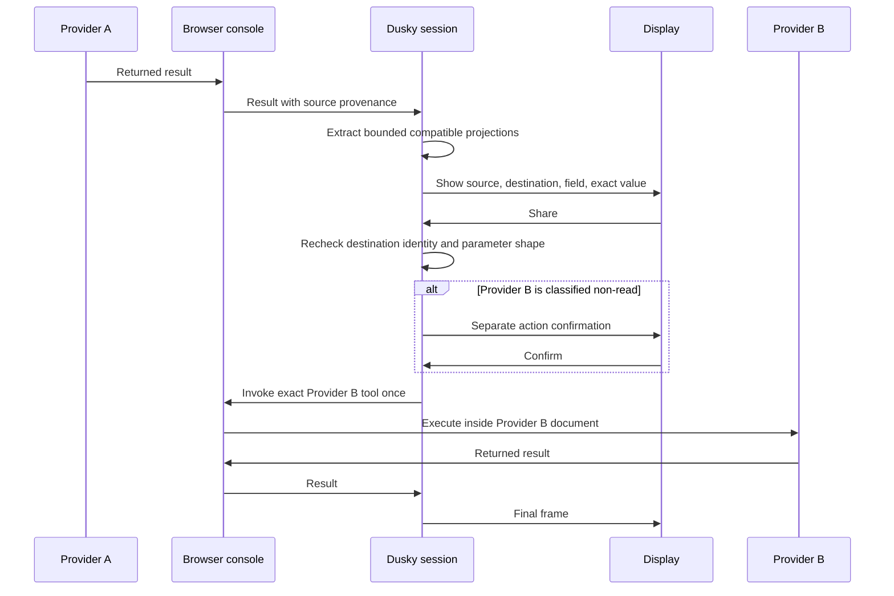

# Trust model

Dusky separates provider capability, model suggestion, task state, and wearer
authority.

- Live provider handles and browser-managed session state stay in the browser.
- Tool arguments and raw result strings pass through the relay.
- The relay owns task state.
- Deterministic code decides whether a declared action must stop.
- The wearer approves on the glasses.
- A model may propose a plan but cannot authorize it.

## Identity and stale input

The browser-supplied origin is the provider identity. A configured display name
is cosmetic and is never used for authorization or invocation.

A tool is identified by `(origin, name)`. A bare name resolves only when it is
unique among the candidates actually offered.

Every Display choice, text submission, cancellation, and device position names
the frame that produced it. `SessionActor` accepts it only when that id matches the current
frame. Delayed input is ignored and the current frame is replayed.

A pending action is also bound to the exact tool declaration that produced its
parameters and policy. The session rechecks that declaration after discovery,
and the console checks it again against the live handle immediately before
invocation. A provider change requires the wearer to choose the action again.

## Untrusted inputs

Provider-controlled input includes:

- tool names, titles, and descriptions;
- JSON Schema;
- annotations;
- returned text and JSON;
- invocation errors.

Tool results remain untrusted whether or not a provider sets
`untrustedContentHint`. Dusky renders bounded inert text and never executes
returned markup.

Planner output is also untrusted. Deterministic code resolves it against the
live registry, supported parameter shapes, and policy.

## Deterministic policy

`packages/policy` classifies each declaration as read, write, financial, or
destructive. Unknown tools default to write. Every classification other than
read requires wearer confirmation.

`readOnlyHint` is a provider claim, not proof. It may lower ceremony only when
hard financial or destructive evidence and a leading mutation verb do not
contradict it. Hard signals in declared parameter names and descriptions count
as evidence.

The classifier cannot inspect provider implementation. A malicious provider
can publish an innocent declaration and perform an undeclared side effect.
Dusky controls behavior derived from the declaration but cannot prove provider
behavior.

One confirmation authorizes one invocation.

## Planner data and limits

The planner is off by default. When enabled, an operator explicitly selects
OpenAI or Anthropic. The relay sends only that selected model provider:

- the wearer's request;
- a ranked shortlist of tool cards;
- browser-supplied origins and bounded provider-authored names, titles,
  descriptions, normalized parameter kinds and descriptions, enum values, and
  the untrusted-content flag;
- ceremony derived by deterministic Dusky policy.

Provider text is flattened, stripped of control characters and quotes, and
bounded before it enters a prompt. This prevents a provider from forging card
structure. It does not make the provider's prose trustworthy.

Prior raw tool results and retained transfer projections are not sent to the
planner.

A task contains at most four ordered end actions. Planner output is checked in
`packages/planner` and independently in `packages/session`:

- each tool identity must resolve to one offered, Display-operable tool;
- ambiguous bare names are refused;
- only arguments declared by that tool are retained;
- supported primitive conversion and enum membership are checked;
- each queued step is resolved again when it begins.

An unknown, ambiguous, non-operable, or overlong plan is refused as a unit.
Invalid or undeclared proposed arguments are dropped, and the ordinary Display
parameter flow asks the wearer for any required value that remains missing.

Dusky does not implement full JSON Schema validation. It does not enforce
constraints such as `minimum`, `pattern`, or `format`. Providers must validate
all inputs before performing an action.

Both adapters request the same stable structured decision. Refusal, incomplete
or malformed output, failure, or timeout returns the wearer to deterministic
menus and parameters. Transport, authentication, quota, and service failures
remain observable in the planner failure path; they still grant no authority.
An unavailable planner can cost latency but cannot block menu navigation.

Model credentials remain server-side. They are not included in prompts, tool
cards, Display frames, console messages, provider pages, logs, or audit events.

## Automatic lookups

A resolver may help fill an argument without first showing a confirmation. It
must be read-only and come from the same origin as its target tool.

This is checked before candidates reach the planner and checked again when the
session accepts the answer. Cross-origin reuse always follows the explicit
transfer path.

## Cross-origin transfer

A successful intermediate result is reduced to bounded, inert projections. The
raw result is not retained as task state or returned to the planner.

Current extraction limits are:

- 32,768 input characters;
- 128 visited nodes;
- depth 6;
- 12 projections;
- 120 characters for one complete shareable string.

Each projection records source origin, source tool, task step, value type, and
a stable JSON location or summary marker.

Same-origin reuse follows ordinary parameter handling. Cross-origin reuse shows
a dedicated transfer frame with the producing provider, receiving provider,
destination argument, exact bounded value, Share, and Cancel.

Only Share or Cancel is accepted while that frame is active. Submitted text or
stale choices cannot fall through into parameter collection.

Immediately before applying the value, the session verifies the current
destination identity, exact parameter schema snapshot, argument name, supported
type conversion, and enum membership. A registry or schema change invalidates
approval.

Sharing fills one argument. It does not approve the destination action. The
destination then follows its own policy gate.

Cancellation, replacement, failure, completion, or actor expiry clears
retained projections and pending transfer state.

## The wearer's own position

WebMCP has no ambient-context channel. `executeTool` carries the input a site
declared and an `AbortSignal`, so a coordinate can reach a provider only as an
argument, which makes it the same kind of movement the transfer path already
governs. It follows that path rather than a parallel one.

Dusky recognizes a required parameter named `latitude`, `lat`, `longitude`,
`lng`, or `lon` and offers the wearer's device as one way to answer it. The
composer remains available for every one of them.

Not on every screen, deliberately. Inside a multi-step task, a compatible value
retained from an earlier step is still offered first, because a value the
wearer's own task produced is more specific than a sensor reading. The device
row appears when there is no such value, which is every single-step task and
every first step.

The read is a wearer gesture, not a relay request. Pressing the row calls
`navigator.geolocation` inside the Display's own keypress handler, which is
where the platform expects a location permission request to be. There is no
watch, no ambient reading, and no read at any other moment.

The value is bounded before it leaves the device. The Display rounds to four
decimal places, roughly eleven metres, and the relay rejects a reading that is
out of range or finer than that.

Applying it is a separate decision from reading it. The reading becomes a
transfer frame naming the wearer's device, the destination site, the
destination argument, and the exact value, with Share and Cancel. Only Share
applies it, and it fills exactly one argument: a tool needing both halves of a
coordinate asks twice. Sharing does not approve the destination action, which
then follows its own policy gate.

Nothing is retained. Dusky stores no position: it exists as pending transfer
state while the wearer is deciding, and is cleared by Share, Cancel, failure,
completion, replacement, or actor expiry. It is never sent to the planner, for
the same reason a retained projection is not.

Audit entries record the device as the source, the destination origin and
argument, and the decision. They do not record the coordinate.

A provider cannot read a position for itself. Provider documents are mounted
with `allow="tools"` alone, and Permissions Policy defaults every other feature
to `self`, so `navigator.geolocation` inside a provider frame fails with
`PERMISSION_DENIED` and no prompt. This is measured, not assumed; see
[WebMCP and display runtime](./WEBMCP-RUNTIME.md).

The relay is inside the trust boundary here, as it is for tool arguments
generally. A reading crosses it between the press and the wearer's decision.

## Results, timeouts, cancellation, and retries

Success is derived from the returned result, not from the fact that a function
returned. An explicit negative result is failure. Unknown result shapes are not
automatically called failures.

A timeout means the outcome is unknown because the provider may still finish.
No provider invocation is used to probe browser compatibility, and each
provider call is sent once. A non-read action is never retried automatically.

Cancellation clears pending and future task state. It cannot recall an
invocation already sent to a provider, whose outcome remains unknown until a
result arrives or the session times out.

## Browser-agent requests

The console publishes four Dusky tools to an agent in the same browser:

- inspect Display status;
- list Display actions;
- send a task to the Display;
- cancel the active task.

These requests contain no session identifier. They affect only the session
paired with that console document.

A new agent task is refused while the wearer is deciding or an unfinished task
is active. Agent cancellation may clear pending or future work, but it cannot
stop an invocation already sent.

## Relay and audit boundary

Browser-managed cookies and session state are not copied into WebMCP tool
descriptors. Tool arguments and raw result strings do pass between the console
and relay, so the relay is part of the trusted deployment. A provider could
also declare a credential-like argument or return sensitive data. Dusky does
not prevent that schema or result shape.

Audit events record identity, provenance, bounded structural location, type,
destination argument, decision, and outcome. They do not record transferred
values, provider-written result keys, or message bodies.

Pairing codes are short bearer capabilities, not account authentication. See
[Security](../SECURITY.md) for their exact operational limits.
